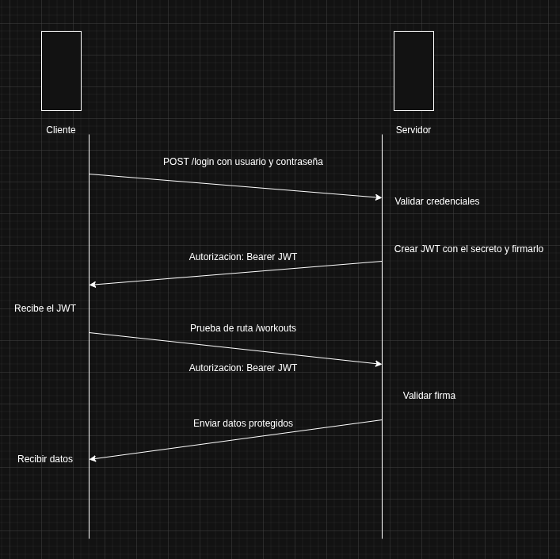

# Docs

## Backend

### API Rest

#### Definición

Una API REST es un patron de diseño arquitectural, que permite la comunicacion con nuestro backend mediante peticiones HTTP para realizar operaciones CRUD sobre los recursos que expone la API.

Los recursos que son elementos que nos interesan ya que podemos identificarlos y manipularlos mediante las operaciones CRUD, que puede ser una entidad tangible como un cliente, producto, etc, tambien podria ser un servicio, una transaccion o un calculo.

- Create: verbo POST, lo utilizaremos para crear recursos en la base de datos.

- Read: verbo GET, lo utilizaremos por consultar recursos en la base de datos.

- Update: verbo PUT o PATCH, lo utilizaremos para actualizar recursos en la base de datos.

- Delete: verbo DELETE, lo utilizaremos para borrar recursos en la base de datos.

#### Características

- Desacoplamiento cliente-servidor: las aplicaciones por parte del servidor y el cliente deberan ser independientes, la unica manera de interactuar será mediante peticiones HTTP.

- Sin estado: es un metodo de comunicación donde el servidor completa solicitudes del cliente para obtener recursos sin importar las realizadas anteriormente.

- Flexibilidad: pueden ser adaptadas a casi todas las aplicaciones, sin importar su formato, lenguaje y arquitectura.

### ORM

#### Definición

Es una herramienta que nos permite trabajar con bases de datos relacionales utilizando el paradigma de la orientacion a objetos, y para ello nos da metodos que por debajo usan codigo SQL, para que no tengamos que escribirlo nosotros a mano.

### Repository Pattern

#### Definición

El patron repositorio actua como un intermediario entre la capa de negocio de una aplicacion y la base de datos.

Usando este patron podremos acceder y manejar mejor la información de la base de datos y tendremos los conceptos mas separados y limpios, haciendo que el código sea mas facil de mantener, testear y adaptarlo a cambios en la base de datos.

### Autenticacion JWT

#### JWT

Es un estandar para poder propagar informacion entre dos partes de forma segura la identidad de un usuario, el usuario tendra unos privilegios que estaran dentro del payload o cuerpo de un mensaje firmado digitalmente.

En la practica es una cadena de texto que tiene 3 partes codificadas en base64 y cada una de ellas esta separada por un punto.

#### Estructura

- Header

  - Es el encabezado donde se indica el algoritmo y tipo de token.

- Payload

  - Donde aparecen los datos de usuario, privilegios y el resto informacion que queramos añadir. Estara todo serializado en JSON.

- Signature

  - Firma que nos permite verificar si el token es válido. Esto se usa para verificar que el token no ha sido alterado durante su transferencia.

#### Ciclo de vida diagrama

##### Hash
